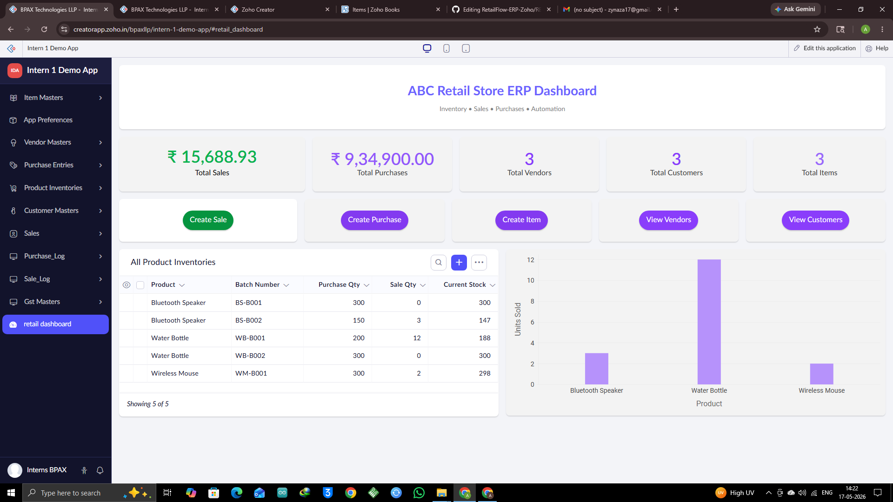
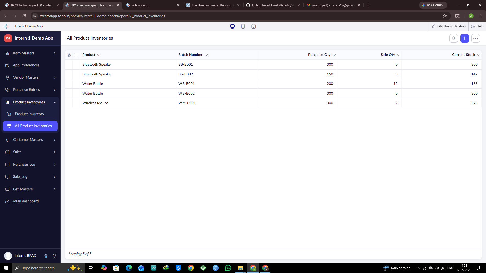
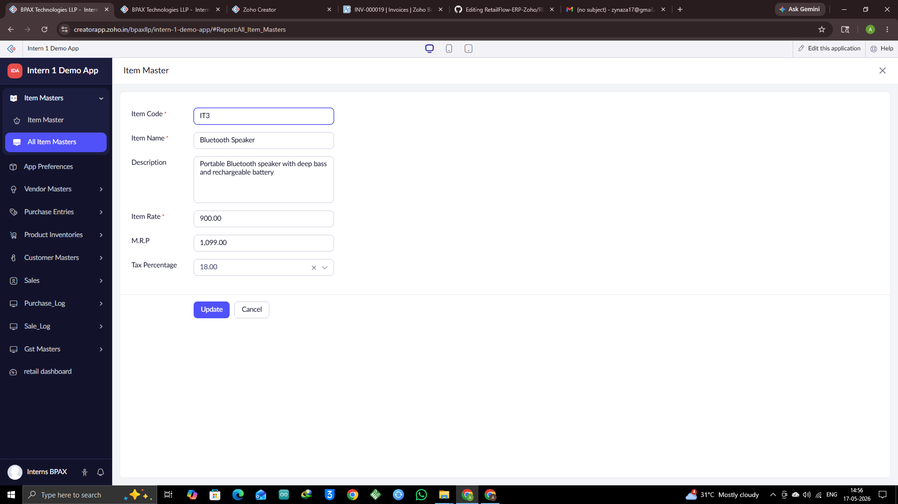
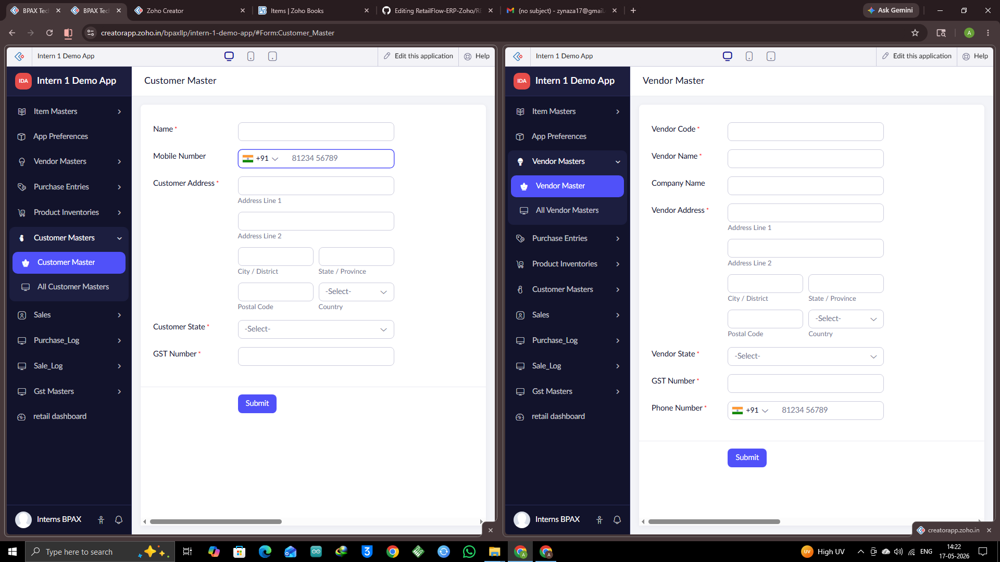

# RetailFlow ERP System

A fully integrated retail ERP and inventory management system built using Zoho Creator and Zoho Books.

This project was developed to automate retail business workflows including inventory management, purchase tracking, sales processing, GST handling, vendor/customer management, accounting synchronization, and dashboard analytics.

The system combines low-code application development with custom Deluge automation logic and Zoho Books API integration to create a real-world business management solution.

---

# Dashboard Preview

## Main ERP Dashboard

## Sales Entry Form

## Purchase Entry Form

## Product Inventory Report

## Item Master Form

## Vendor & Customer Management

## Zoho Books Inventory & Financial Reports

---

# Project Overview

RetailFlow ERP was designed to simulate a real-world retail management system where inventory, purchases, sales, taxation, and accounting are interconnected.

The application focuses heavily on workflow automation and real-time synchronization between Zoho Creator and Zoho Books.

Every transaction made inside the ERP automatically affects inventory levels, accounting records, and financial summaries.

---

# Core Features

## Inventory Management
- Real-time inventory tracking
- Automatic stock updates after sales and purchases
- Current stock recalculation logic
- Inventory synchronization between Zoho Creator and Zoho Books
- Inventory summary reporting

## Sales Management
- Multi-item sales entry using subforms
- Automatic grand total calculation
- GST and IGST tax calculation
- Real-time invoice generation in Zoho Books
- Automatic inventory deduction after sales
- Edit/update sales with automatic recalculation

## Purchase Management
- Purchase entry automation
- Vendor-linked purchase workflows
- Bill creation in Zoho Books
- Automatic inventory increment after purchases
- Purchase log maintenance

## Vendor & Customer Management
- Dedicated vendor master records
- Dedicated customer master records
- Contact synchronization with Zoho Books
- Centralized business entity management

## Dashboard & Analytics
- ERP dashboard with business KPIs
- Sales and purchase analytics
- Inventory visualization charts
- Real-time metrics display
- Product-wise sales analysis

## Taxation & GST Logic
- Dynamic GST and IGST calculation
- Tax logic based on organization state and customer/vendor location
- Automatic tax percentage application
- Support for multiple GST percentages
- Integrated tax handling in invoices and bills

---

# Zoho Books Integration

This ERP system is deeply integrated with Zoho Books using APIs and workflow automation.

## API-Based Features
- Invoice creation in Zoho Books
- Bill generation from purchase entries
- Customer synchronization
- Vendor synchronization
- Item synchronization
- Inventory updates
- Financial record consistency

## Financial Reports Supported Through Zoho Books
- Balance Sheet
- Profit & Loss Report
- Inventory Summary
- Profit by Item
- Sales Reports
- Purchase Reports

The inventory values reflected inside Zoho Creator are synchronized with the inventory summaries generated in Zoho Books.

---

# Forms & Modules Created

| Module | Purpose |
|---|---|
| Item Masters | Stores product/item information |
| Vendor Masters | Stores vendor/supplier details |
| Customer Masters | Stores customer details |
| Purchase Entries | Records purchases and updates stock |
| Sales | Records sales and deducts stock |
| Product Inventories | Displays current inventory levels |
| Purchase Log | Maintains purchase transaction history |
| Sale Log | Maintains sales transaction history |
| GST Masters | Stores GST percentage configurations |
| Retail Dashboard | Displays ERP analytics and KPIs |

---

# Workflow Automation

This project contains multiple Deluge-based automation workflows.

## Major Workflow Automations
- Automatic stock recalculation
- Sales-to-inventory synchronization
- Purchase-to-inventory synchronization
- Dynamic tax handling
- Invoice and bill generation
- Real-time dashboard updates
- Edit/update synchronization workflows
- Validation logic to prevent incorrect inventory calculations

---

# Technologies Used

- Zoho Creator
- Deluge Scripting
- Zoho Books APIs
- REST API Integration
- Low-Code Development
- Dashboard Analytics

---

# Key Learning Outcomes

This project involved solving real-world ERP and inventory management problems such as:
- Inventory consistency
- Transaction synchronization
- GST handling
- Financial workflow automation
- API integration challenges
- Real-time data recalculation
- Business process automation

The project required extensive debugging, workflow restructuring, and business logic optimization to ensure reliable synchronization between Creator and Books.

---

# Future Improvements

- Barcode integration
- Role-based access control
- AI-based sales prediction
- Low-stock alerts
- Advanced analytics dashboards
- Mobile ERP interface
- Supplier performance analytics

--
# Author

Developed by Aza
BCA Student | ERP Automation | AI & Data Enthusiast
